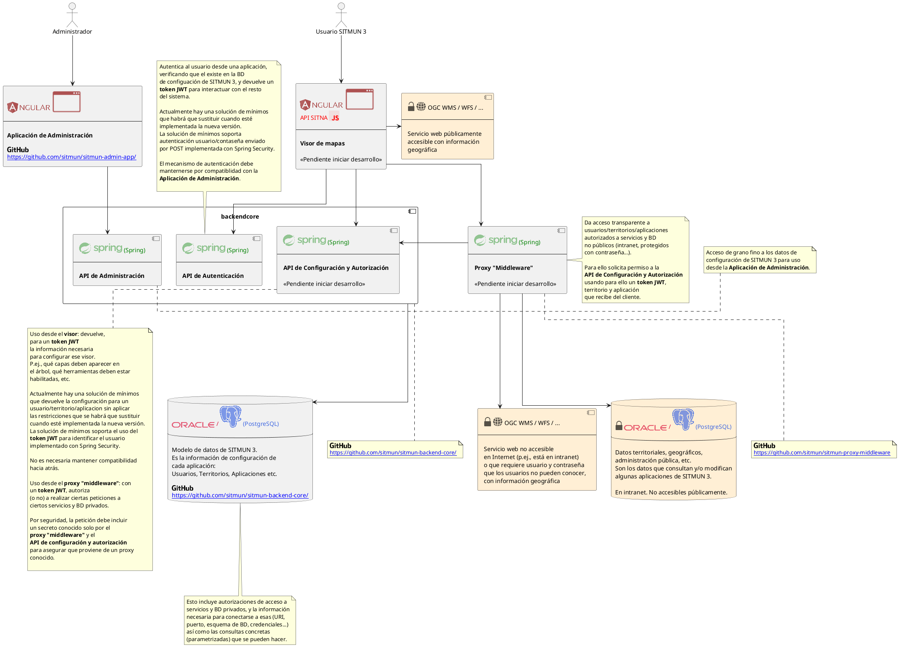
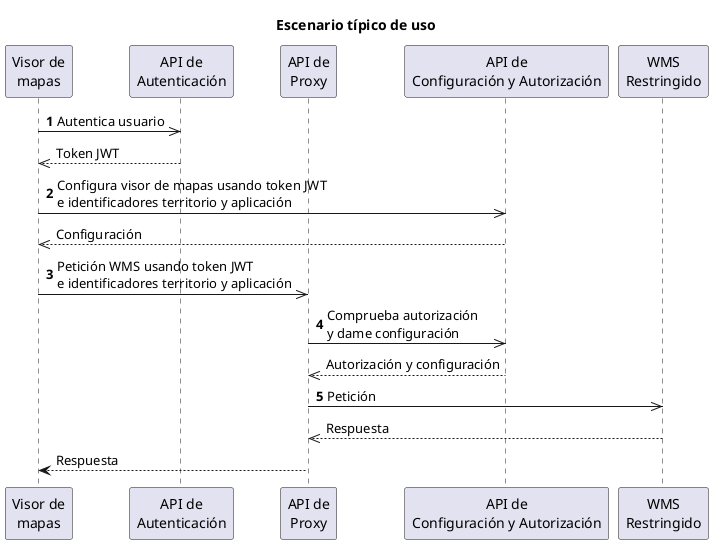
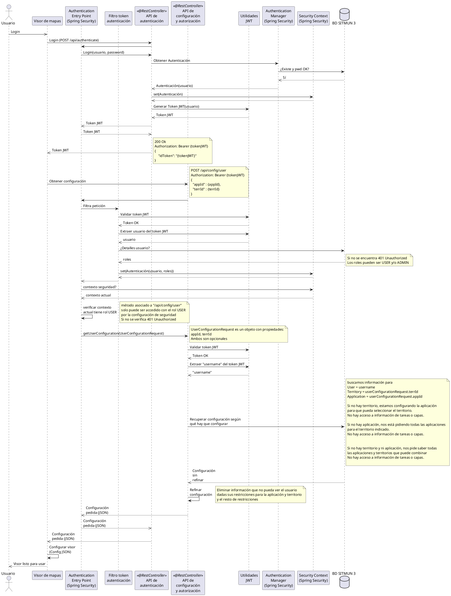
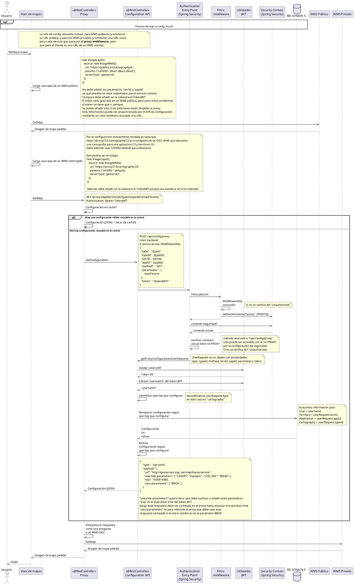
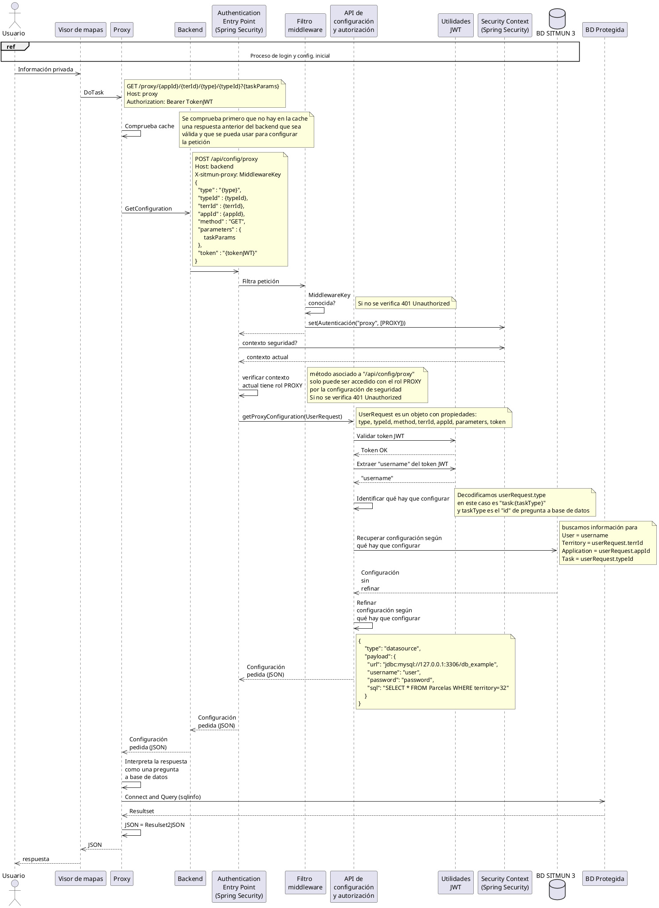
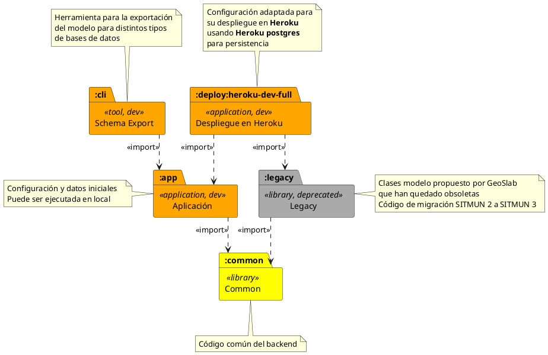
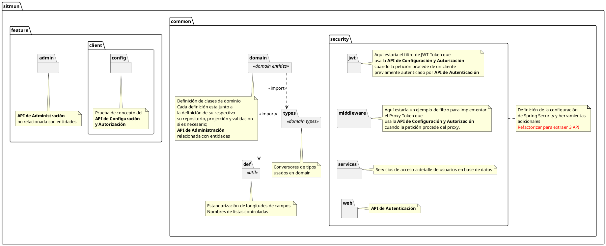
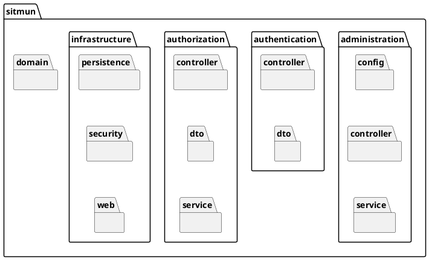
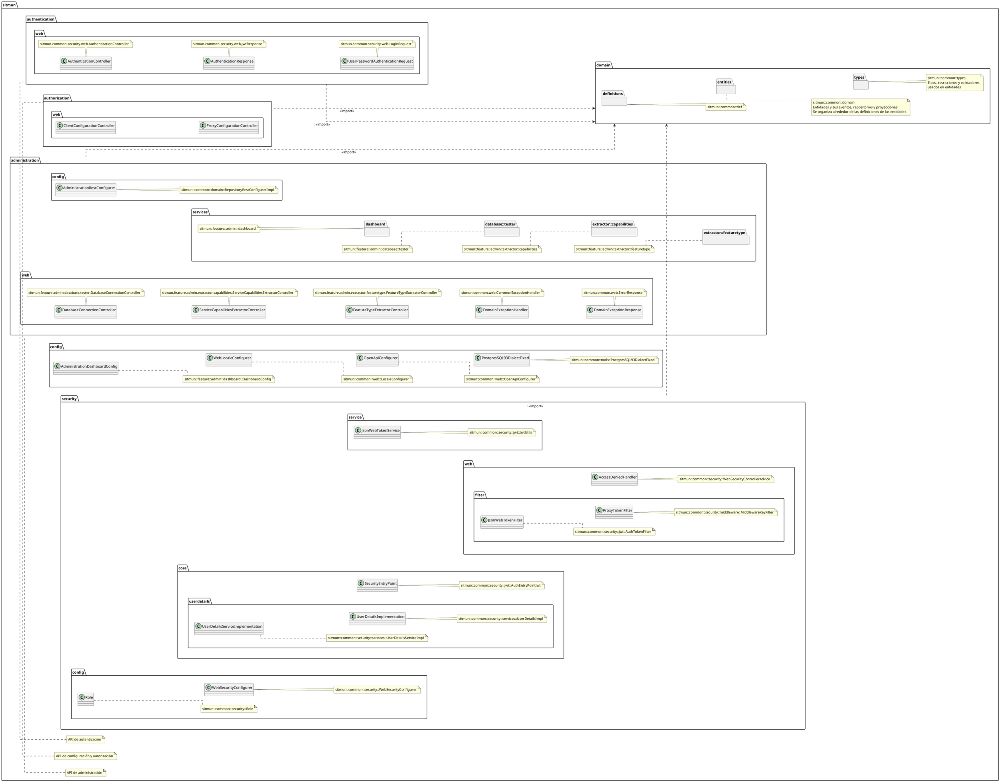

# Arquitectura de SITMUN 3

**SITMUN 3** es un sistema de código libre para poner en marcha sistemas de información territoriales donde múltiples usuarios puedan acceder a distintas aplicaciones según sus necesidades. Esto incluye:

- Unas aplicaciones de usuario final. 
  - La aplicación “básica” es un visor de mapas web, pero hay otras y pueden tomar formas muy distintas si es necesario.
  - En general, estas aplicaciones deben ser configuradas para resultar útiles. Esta configuración incluye indicar las herramientas específicas que van a ofrecer a sus usuarios, así como los servicios, capas o bases de datos accesibles; también incluye restricciones de acceso, basadas en usuarios, roles y territorios concretos.
    - P.ej., una aplicación puede ser el visor de mapas básico. Y si te identificas como usuario “público” del territorio “Municipio X” esa configuración describe cómo en el árbol de capas del mapa tienen que aparecer ciertos servicios web de mapas, y no otros, y no debe aparecer ninguna herramienta que permita modificar datos o acceder a BD privadas.
  - Estas aplicaciones obtienen su configuración cada vez que arrancan (porque depende del usuario, rol y territorio que se haya identificado, y porque puede haber cambiado desde la vez anterior) de una API REST. Esta API accede a la BD de SITMUN y no es la misma que usa la aplicación web de administración. Y finalmente aplican la configuración obtenida antes de permitir a los usuarios ponerse a trabajar.
- Una aplicación web de administración.
  - Esta aplicación es para que los administradores de las organizaciones que instalan **SITMUN 3** configuren las aplicaciones que quieran ofrecer a sus usuarios.
    - P.ej., podemos añadir un nuevo servicio de mapas públicamente accesible que acabamos de encontrar al visor de mapas básico para usuarios públicos de cualquier territorio. La próxima vez que un usuario público acceda verá que hay una capa más que la vez anterior.
  - Esta aplicación lee y modifica los datos en la BD de **SITMUN 3** a través de una API REST.
- Algunos componentes adicionales que se usan en varias aplicaciones, (tanto en la de administración como en las de usuario final):
  - Proxy “middleware”: es un proxy inverso para que se pueda dar acceso a servicios y bases de datos protegidos (bien sea porque están en una Intranet, y los usuarios están fuera de ella, o bien porque requieren credenciales de acceso y los usuarios no las deben conocer, o bien porque quiere modificarse la información que ofrecen antes de devolverla a la aplicación cliente, por ejemplo, enmascarando parte de una imagen con un mapa). 
    - Es un proxy inverso y por tanto el cliente no puede elegir usarlo o no, y esencialmente le resulta transparente.
  - API de autenticación: permite a los usuarios y administradores identificarse utilizando distintos mecanismos que puedan estar disponibles en las distintas organizaciones (Microsoft Active Directory, servicios LDAP y otros).

**SITMUN 3** no tiene un conjunto de datos o servicios geográficos/territoriales predefinidos. Cada despliegue de **SITMUN 3** se hace para una organización concreta, normalmente supramunicipal, y esta organización debe decidir qué aplicaciones quiere ofrecer a sus usuarios, típicamente personal técnico de los municipios, y qué servicios y datos geográficos/territoriales van a estar accesibles en estas aplicaciones. Estos servicios y bases de datos los tendrá que tener en sus propios sistemas, o bien tendrán que estar en algún sitio al que puedan acceder.

Las aplicaciones de usuario final de **SITMUN 3** interactúan relativamente poco con las API y componentes de **SITMUN 3**:
- Con la API de autenticación solo al principio, para identificar al usuario.
- Con la API de configuración solo en el arranque.
- La mayor parte de las peticiones las van a hacer contra servicios de mapas y bases de datos.
  - Las que sean intranet, protegidas etc. irán a través del Proxy “middleware”, las demás serán directas.

Esto conviene tenerlo en cuenta cuando estemos dimensionando el hardware que necesitamos para el despliegue, y cómo lo vamos a repartir.

**SITMUN 3** tiene una arquitectura de 3-tiers. Las aplicaciones web se desarrollan con Angular, Spring Boot se usa en el tier web, y una base de datos relacional (Oracle o PostgreSQL a día de hoy, pero se pueden usar otras) en el tier de datos.

## Principales componentes

## Escenario típico de uso

Un escenario típico de uso que ejemplifica la interacción de estos componentes sería:

1. El usuario abre una aplicación de SITMUN, por ejemplo, un visor de información territorial,
   selecciona un territorio y se autentica. 
   Para ello, el visor interactúa con el [Servicio de Autenticación][servicio-de-autenticacion], obteniendo un token JWT.
2. El visor obtiene la información para su configuración para este usuario, territorio y aplicación 
   interactuando directamente con el [Servicio de Configuración y Autorización][servicio-de-configuracion-y-autorizacion].
   A esta petición el visor le ha añadido el token JWT, el identificador de territorio y el identificador de aplicación.
3. El usuario interactúa con el visor y, por ejemplo, hace visible una capa que corresponde a un 
   servicio WMS restringido por territorio o realiza una búsqueda entre los datos alfanuméricos del 
   padrón municipal de habitantes de un municipio. Esta petición ocurrirá a través del [Servicio de proxy][servicio-de-proxy]. 
   A esta petición el visor le ha añadido el token JWT, el identificador de territorio y el identificador de aplicación.
4. Con esta información, el [Servicio de proxy][servicio-de-proxy] interactúa con el [Servicio de Configuración y Autorización][servicio-de-configuracion-y-autorizacion]
   para determinar si puede hacer la petición y, si puede hacerla, cómo debe interrogar este servicio restringido.
   En este caso, por ejemplo, qué parámetros adicionales hay que añadir a la petición para limitar la respuesta a un territorio concreto. 
5. Después, el [Servicio de proxy][servicio-de-proxy] hace la petición al servicio WMS restringido con estos parámetros adicionales y devuelve la respuesta al visor tras aplicar alguna transformación si fuera necesaria.

## Diagramas de secuencia
En esta sección se documentan algunas de las interacciones más relevantes del sistema en forma de diagramas de secuencia.

### Login

### Uso del proxy para acceder a un WMS privado

### Uso del proxy para acceder a una BD en Intranet

### Diagrama de módulos
[sitmun-backend-core](https://github.com/sitmun/sitmun-backend-core) es un proyecto multimódulo.

Hay 3 tipos de módulos:
- **Módulos estables (en amarillo)**. Lógica principal de **SITMUN 3** y componentes de soporte.
- **Módulos de desarrollo (en naranja)**. Datos de prueba, despliegues de prueba y herramientas de apoyo (front end y línea de comandos).
- **Módulos legados (en gris)**. Clases y funcionalidades que se han ido desechando pero que todavía no han sido eliminadas definitivamente. 

## Diagrama de paquetes

Es la biblioteca que contiene la definición del modelo de datos de **SITMUN 3**, la API de autenticación, la API de configuración y autorización y la política de seguridad.

### Paquetes (Arquitectura por Capas)
En general, cada API que en despliegue quede expuesta de manera separada, es decir, con su propio endpoint HTTP, tiene un paquete. 

- subpaquete `authentication` que corresponde con la **API de Autenticación**.
- subpaquete `authorization` que corresponde con la **API de Configuración y Autorización**.
- subpaquete `administration` que corresponde con la **API de Administración**.

Cada uno de estos paquetes puede contener: 

- subpaquete `controller`: contiene los controladores (clases anotadas con `@Controller`) y otras cosas necesarias para implementar ese endpoint HTTP. 
- subpaquete `service`: contiene los servicios de aplicación específicos del API (clases anotadas con `@Service`) y clases asociadas. Estos servicos sólo se invocarán desde los controladores del paquete `controller`.
- subpaquete `config`: contiene la configuración específica de los componentes del endpoint definidos en los paquetes `web` y `service`. Normalmente son clases anotadas con `@Configuration` y parte de la configuración puede estar referidad a clases de infraestructura (de biblioteca) de Spring Framework. 

Además hay dos paquetes adicionales:

- paquete `domain` que contiene las clases y los tipos del modelo de **SITMUN 3**. Es decir, el modelo que permite definir aplicaciones **SITMUN 3**, los territorios en
los que están disponibles, a qué servicios territorios y bases de datos pueden
acceder y qué usuarios pueden utilizarlas.  Los paquetes que contienen las clases de domino están anidados, de tal forma que las clases de dominio dependientes de otra aparecen en un subpquete del paquete que contiene la clase principal. Las entidades del paquete `entities` se exponen a través de la **API de Administración** usando el framework **Spring Data REST**.
- paquete `infrastructure` que describe los componentes de infrastructura (persistencia, seguridad, web).

El paquete `infrastructure` contiene:
- subpaquete `persistence`
- subpaquete `security`

Se divide en tres subpquetes: el paquete `definition` con constantes, el paquete `entities` con las clases de dominio, y el paquete `types` con los tipos del dominio. El paquete `entities`, además de las clases de dominio, contiene agrupadas junto a la clase formando paquetes la definición de los accesos a base de datos (interfaces anotadas con `@Repository`), las definiciones de las proyecciones y mecanismos de validación de datos del dominio.

 El paquete `types` contiene la definición de conversores y anotaciones que permiten ser más expresivo en la definición del modelo en el paquete `entities`.

- paquete `security` que contiene la configuración del framework de seguridad
`Spring Security`. `Spring Security` proporciona diversas formas de aplicar seguridad a nivel de aplicación que permite establecer políticas de acceso a controladores, servicios y repositorios en función del rol que se le asigne al usuario en función de sus credenciales: `USER`, `ADMIN`, `PROXY`. Además, este
paquete asegura que todos los accesos anónimos sean identificados como un acceso con usuario *público*. 

La relación de las API públicas con el paquete `security`es la siguiente:

  - La **API de Autenticación** del paquete `authentication` usa servicios y 
  componentes de Spring Framework configurados por el paquete `security` para
  autenticar un usuario cuando solicita un token JWT de autenticación.  
  - Los controladores de la **API de Configuración y Autorización** solo podrán
  ser accedidos por usuarios a los se haya determinado que tengan el rol 
  `USER` (clientes **SITMUN 3**) o el rol `PROXY` (proxy). Es misión del paquete
  `security` establecer los filtros necesarios para interceptar las peticiones
  y en función de los mecanismos de seguridad implementados (token JWT para
  el rol `USER`, API key para el rol `PROXY`) determinar si están autenticadas
  y asignar la identidad y el rol correspondiente.
  - Los controladores de la **API de Administración** (tanto los definidos 
  explícitamente como los generados dinámicamente por **Spring Data REST**) 
  solo podrán ser accedidos por usuarios a los que se haya determinado que 
  tengan el rol `ADMIN`. Como en el caso anterior, es misión del paquete
  `security` establecer los filtros necesarios para interceptar las peticiones
  y en función de los mecanismos de seguridad implementados (token JWT para el
  rol `ADMIN`) determinar si están autenticadas y asignar la identidad y el rol
  correspondiente.

Como se puede deducir de las explicaciones anteriores:

- la **API de Autenticación** expone vía una API Web mecanismos para interactuar con el sistema de seguridad de la aplicación definido en `security`.
- la **API de Administración** expone vía una API Web mecanismos para modificar el estado de los objetos de dominio definidos en `domain` por parte de los administradores.
- la **API de Configuración y Autorización** expone vía una API Web mecanismos para obtener una configuración derivada del estado actual de los objetos de dominio definidos en `domain` en función de la identidad y rol del que solicita la información.

### Clases

