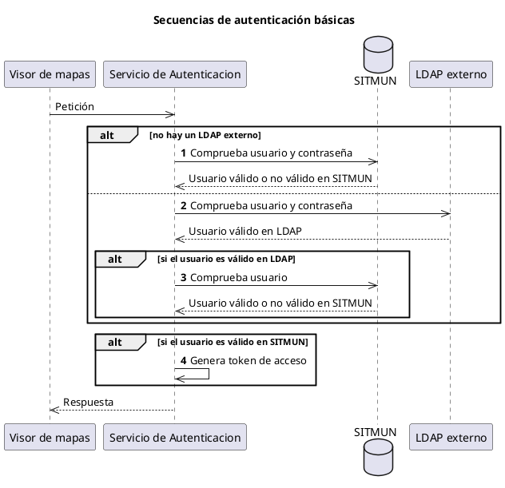
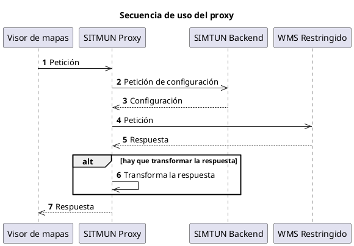

# Diseño

## Servicio de Autenticación

El **Servicio de Autenticación** permite que los usuarios se identifiquen en la plataforma SITMUN.
Tras la identificación, este servicio devuelve un token de acceso [JSON web token](https://jwt.io/) (JWT)
que permite al usuario acceder a los servicios de la plataforma.
SITMUN almacena las contraseñas de los usuarios en la base de datos SITMUN usando un hash criptográfico ([bcrypt](https://es.wikipedia.org/wiki/Bcrypt)). Tambien está soportado el uso de [Active Directory (AD)](https://es.wikipedia.org/wiki/Active_Directory) a través de un servidor LDAP.
Hay que señalar que está planteado soportar la autenticación de usuarios a través de certificados digitales.

Este servicio se expone vía la **[API de Autenticación][api-de-autenticacion]**.

### Comportamiento esperado

El **Servicio de Autenticación** puede funcionar de dos formas distintas tras recibir la petición de un usuario.



El comportamiento espera es el siguiente:

1. Si no se configura el uso de un LDAP externo, el **Servicio de Autenticación** comprueba si el usuario y la contraseña son válidos en SITMUN y pasa al punto ④.
2. Si se configura el uso de un LDAP externo, el **Servicio de Autenticación** comprueba si el usuario y la contraseña son válidos en el LDAP externo. 
3. Si el usuario es válido, el **Servicio de Autenticación** comprueba si el usuario es válido en SITMUN.
4. Si el usuario es válido en SITMUN, el **Servicio de Autenticación** genera un token de acceso que es devuelto al cliente.

## Servicio de Configuración y Autorización

El **Servicio de Configuración y Autorización** se encarga de determinar qué puede hacer el **[Servicio de Proxy][servicio-de-proxy]** en cada petición realizada por un usuario.
Si la petición no contiene el token de acceso del usuario, se asumirá que es una petición realizada para el usuario `público`.

Este servicio se expone vía la **[API de Configuración y Autorización][api-de-configuracion-y-autorizacion]**.

## Servicio de Proxy

Un componente clave del sistema es un **[proxy inverso](https://es.wikipedia.org/wiki/Proxy_inverso)** 
que actúa como un intermediario entre los clientes de SITMUN y diversas fuentes de datos,
como servicios web y bases de datos remotas, permitiendo controlar el acceso a la información,
ya sea geográfica o no. 

El proxy inverso es capaz de manejar peticiones a diversos tipos de servicios, incluyendo:

- Servicios [OGC Web Map Service (WMS)](https://www.ogc.org/standard/wms/),
  que ofrecen mapas en formato imagen.
- Servicios [OGC Web Map Tile Service (WMTS)](https://www.ogc.org/standard/wmts/),
  que proporcionan mapas divididos en teselas (*tiles*).
- Servicios [OGC Web Feature Service (WFS)](https://www.ogc.org/standard/wfs/), 
  que permiten el acceso a datos geoespaciales vectoriales.
- Bases de datos relacionales que dispongan de un controlador (*driver*) [JDBC (Java Database Connectivity)](https://es.wikipedia.org/wiki/Java_Database_Connectivity).
  Las respuestas de las bases de datos se devuelven en formato JSON.

Para acceder a través del **proxy**, todas las peticiones deben incluir un token de acceso JWT,
obtenido previamente a través de la **[API de autenticación][api-de-autenticacion]**, la cual identifica al usuario.
La única excepción es el usuario denominado `público`, cuya autenticación es automática.
Es decir, en caso de no incluir un token de acceso JWT, se asume que se trata del usuario  `público`.
Además, todas las peticiones enviadas a través del **proxy** deben incluir
un identificador de territorio y un identificador de aplicación.

El **proxy** actúa como adaptador, traduciendo las peticiones de los clientes SITMUN a un formato adecuado
para los servicios y datos subyacentes.
Para realizar esta tarea, el **proxy** utiliza la **[API de configuración y autorización][api-de-configuracion-y-autorizacion]**,
que proporciona al **proxy** la información necesaria para construir las solicitudes a los servicios y adaptar las respuestas recibidas.

Ejemplos de uso del **proxy** son los siguientes:

- El **proxy** permite a los clientes interactuar con servicios restringidos sin que el usuario tenga que conocer las credenciales o la URI de los mismos.
- El **proxy** puede filtrar la información proporcionada por un OGC WMS, ocultando la parte que no corresponde al territorio indicado en la petición.

Este servicio se expone a través de la **[API de Proxy][api-de-proxy]**, 
que actúa como punto de entrada para las solicitudes relacionadas.

### Comportamiento esperado

A continuación se muestra el comportamiento esperado del proxy.



El comportamiento esperado es el siguiente:

1. El **visor de mapas** hace una petición que es servida por el **proxy**.
2. El **proxy** realiza una petición a la **[API de configuración y autorización][api-de-configuracion-y-autorizacion]** en el **backend** para obtener la configuración.
3. La **[API de configuración y autorización][api-de-configuracion-y-autorizacion]** proporciona la configuración de la petición al servicio remoto al **proxy**.
4. El **proxy** compone una petición adecuada al servicio remoto y la envía.
5. El **servicio remoto** devuelve una respuesta.
6. Si es necesario, el **proxy** aplica una transformación a la respuesta.
7. El **proxy** devuelve la respuesta al **visor de mapas**.

### Ejemplo: OGC WMS

Las peticiones a la **API de Proxy** tienen la siguiente forma:

```http
GET /proxy/{appId}/{terId}/{type}/{typeId}?{keys*}
Authorization: Bearer {JWT token}
```

Lo que permite identificar:

- `appId`: identificador de la aplicación que realiza la petición.
- `terId`: identificador del territorio en el que se realiza la petición.
- `type`: tipo de servicio que se solicita.
- `typeId`: identificador del servicio que se solicita.
- `keys`: parámetros adicionales que se envían al servicio.
- `token`: token de autenticación JWT.

Por ejemplo, la siguiente petición correspondería con la petición de acceso a un servicio de mapas remoto:

```http
GET /proxy/1/34/wms/1?SERVICE=WMS&REQUEST=GetMap
    &LAYERS=SITMUN
    &FORMAT=image/png
    &TRANSPARENT=true&VERSION=1.1.1&SRS=EPSG:25831
    &BBOX=405913.25142303,4593667.2516974,411183.74857697,4599953.7483026
    &WIDTH=498&HEIGHT=594
Authorization: Bearer SOME-TOKEN    
```

La petición que el **proxy** realizaría al endpoint `/api/config/proxy` de la **[API de configuración y autorización][api-de-configuracion-y-autorizacion]** seria:

```json
{
  "appId": 1,
  "terId": 34,
  "type": "wms",
  "typeId": 1,
  "method": "GET",
  "parameters": {
    "SERVICE": "WMS",
    "REQUEST": "GetMap",
    "LAYERS": "SITMUN",
    "FORMAT": "image/png",
    "TRANSPARENT": "true",
    "VERSION": "1.1.1",
    "SRS": "EPSG:25831",
    "BBOX": "405913.2514230,4593667.251697,411183.7485769,4599953.748302",
    "WIDTH": "498",
    "HEIGHT": "594"
  },
  "id_token": "SOME-TOKEN"
}
```

La respuesta podría ser como sigue:

```json
{
  "type": "wms",
  "exp": 1623340800,
  "payload": {
    "uri": "https://geoserveis.icgc.cat/icgc_bm5m/wms/service",
    "method": "GET",
    "vary": ["BBOX"],
    "parameters": {
        "SERVICE": "WMS",
        "REQUEST": "GetMap",
        "LAYERS": "01_NIVJERARQUIC_LN,02_TIPUSLINIA_LN",
        "FORMAT": "image/png",
        "TRANSPARENT": "true",
        "VERSION": "1.1.1",
        "SRS": "EPSG:25831",
        "BBOX": "405913.2514230,4593667.251697,411183.7485769,4599953.748302",
        "WIDTH": "498",
        "HEIGHT": "594"
    }
  }
}
```

La petición a realizar por el proxy debe:

- Ser a la URI indicada en el campo `uri` de la respuesta.
- Con el método HTTP indicado en el campo `method` de la respuesta.
- Con los campos y valores indicados en el campo `parameters` de la respuesta.
- Con los campos y valores indicados en el campo `vary` de la petición del **visor de mapas**.

Es decir:

```http
GET /icgc_bm5m/wms/service?SERVICE=WMS&REQUEST=GetMap
    &LAYERS=01_NIVJERARQUIC_LN,02_TIPUSLINIA_LN
    &FORMAT=image/png
    &TRANSPARENT=true&VERSION=1.1.1&SRS=EPSG:25831
    &BBOX=405913.25142303,4593667.2516974,411183.74857697,4599953.7483026
    &WIDTH=498&HEIGHT=594
Host: geoserveis.icgc.cat
```
