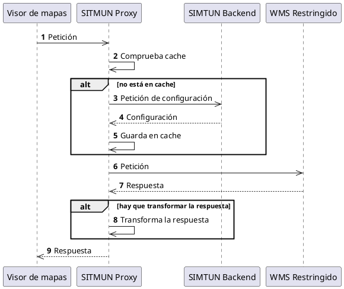

# Diseño

## Servicio de Autenticación

El **Servicio de Autenticación** permite que los usuarios se identifiquen en la plataforma SITMUN.
Tras la identificación, este servicio devuelve un token de acceso [JSON web token](https://jwt.io/) (JWT)
que permite al usuario acceder a los servicios de la plataforma.

Este servicio soporta los siguientes tipos de autenticación:

- Usuario y contraseña.

Las contraseñas se almacenan tras aplicar una [función de derivación de clave](https://es.wikipedia.org/wiki/Funci%C3%B3n_de_derivaci%C3%B3n_de_clave):

- Si van a estar accesibles vía la base de datos SITMUN se utiliza el algoritmo [bcrypt](https://es.wikipedia.org/wiki/Bcrypt).
- Si van a estar accesibles a través del protocolo [LDAP](https://es.wikipedia.org/wiki/Protocolo_ligero_de_acceso_a_directorios) se utiliza el algoritmo [SHA-1](https://es.wikipedia.org/wiki/Secure_Hash_Algorithm#SHA-1) usando el esquema para almacenar contraseñas de LDAP (ver [RFC 2307](https://tools.ietf.org/html/rfc2307)).

Este servicio se expone vía la **[API de Autenticación][api-de-autenticacion]**.

## Servicio de Configuración y Autorización

El **Servicio de Configuración y Autorización** se encarga de determinar qué puede hacer el **[Servicio de Proxy][servicio-de-proxy]** en cada petición realizada por un usuario.
Si la petición no contiene el token de acceso del usuario, se asumirá que es una petición realizada para el usuario `público`.

Este servicio se expone vía la **[API de Configuración y Autorización][api-de-configuracion-y-autorizacion]**.

## Servicio de Proxy

Un componente clave del sistema es un **[proxy inverso](https://es.wikipedia.org/wiki/Proxy_inverso)** que permite
controlar el acceso a la información (geográfica o no) que procede de servicios web o de consultas a bases de datos remotas. 

Soporta peticiones a:

- Servicios [OGC Web Map Service](https://www.ogc.org/standard/wms/).
- Servicios [OGC Web Map Tile Service](https://www.ogc.org/standard/wmts/).
- Servicios [OGC Web Feature Service](https://www.ogc.org/standard/wfs/).
- Servicios [OGC API](https://ogcapi.ogc.org/).
- Bases de datos relacionales que tengan un [driver JDBC](https://es.wikipedia.org/wiki/Java_Database_Connectivity). 
  Las respuestas de las bases de datos se devuelven en formato JSON.

Las peticiones al proxy han de ir acompañadas de un token de acceso JWT, 
obtenido previamente a través de la **[API de autenticación][api-de-autenticacion]**, que identifica al usuario. 
La única excepción es el caso del usuario denominado `público`, donde su autenticación es automática.
Es decir, si no hay credencial, se asume que es el usuario  `público`. 
Además, todas las peticiones que se envían a través del proxy han de incluir, además, 
un identificador de territorio y un identificador de aplicación.

El **proxy** actua como adaptador entre los clientes de SITMUN y servicios y base de datos.
Para llevarlo a cabo, usa la **[API de configuración y autorización][api-de-configuracion-y-autorizacion]**.
Esta API devuelve la información que necesita el **proxy** para crear las peticiones a estos servicios y adaptar sus respuestas. 
Los siguientes son caos de uso de este proxy:

- Interactuar con servicios restringidos sin exponer sus credenciales o localización.
- Aplicar un recorte territorial a la imagen proporcionada por un OGC WMS.

Este servicio se expone vía la **[API de Proxy][api-de-proxy]**.

### Comportamiento esperado

A continuación se muestra el comportamiento esperado del proxy.


El comportamiento esperado es el siguiente:

1. El **visor de mapas** hace una petición que es servida por el **proxy**.
2. El **proxy** comprueba si tiene en caché la configuración del servicio remoto para esta petición.
3. Si no está en la caché del **proxy**, este realiza una petición a la **API de Configuración u Autorización** en el **backend** para obtener la configuración.
4. La **API de Configuración u Autorización** proporciona la configuración de la petición al servicio remoto al **proxy**.
5. El **proxy** guarda en caché la configuración asociada a la petición.
6. El **proxy** compone una petición adecuada al servicio remoto y la envía.
7. El **servicio remoto** devuelve una respuesta.
8. Si es necesario, el **proxy** aplica una transformación a la respuesta.
9. El **proxy** devuelve la respuesta al **visor de mapas**.

### Ejemplo: OGC WMS

Las peticiones al **API de Proxy** tienen la siguiente forma 

```http
GET /proxy/{appId}/{terId}/{type}/{typeId}?{keys*}
Authorization: Bearer {JWT token}
```

Lo que permite identificar:

- `appId`: identificador de la aplicación que realiza la petición.
- `terId`: identificador del territorio en el que se realiza la petición.
- `type`: tipo de servicio que se solicita.
- `typeId`: identificador del servicio que se solicita.
- `keys`: parámetros adicionales que se envían al servicio.
- `token`: token de autenticación JWT.

Por ejemplo, la siguiente petición correspondería con la petición de acceso a un servicio de mapas remoto:

```http
GET /proxy/1/34/wms/1?SERVICE=WMS&REQUEST=GetMap
    &LAYERS=SITMUN
    &FORMAT=image/png
    &TRANSPARENT=true&VERSION=1.1.1&SRS=EPSG:25831
    &BBOX=405913.25142303,4593667.2516974,411183.74857697,4599953.7483026
    &WIDTH=498&HEIGHT=594
Authorization: Bearer SOME-TOKEN    
```

La petición que el **proxy** realizaría al endpoint `/api/config/proxy` de la **API de Configuración y Autorización de Proxy** seria:

```json
{
  "appId": 1,
  "terId": 34,
  "type": "wms",
  "typeId": 1,
  "method": "GET",
  "parameters": {
    "SERVICE": "WMS",
    "REQUEST": "GetMap",
    "LAYERS": "SITMUN",
    "FORMAT": "image/png",
    "TRANSPARENT": "true",
    "VERSION": "1.1.1",
    "SRS": "EPSG:25831",
    "BBOX": "405913.25142303,4593667.2516974,411183.74857697,4599953.7483026",
    "WIDTH": "498",
    "HEIGHT": "594"
  },
  "id_token": "SOME-TOKEN"
}
```

La respuesta podría ser como sigue:

```json
{
  "type": "wms",
  "exp": 1623340800,
  "vary": ["BBOX"],
  "payload": {
    "uri": "https://geoserveis.icgc.cat/icgc_bm5m/wms/service",
    "method": "GET",
    "parameters": {
        "SERVICE": "WMS",
        "REQUEST": "GetMap",
        "LAYERS": "01_NIVJERARQUIC_LN,02_TIPUSLINIA_LN",
        "FORMAT": "image/png",
        "TRANSPARENT": "true",
        "VERSION": "1.1.1",
        "SRS": "EPSG:25831",
        "WIDTH": "498",
        "HEIGHT": "594"
    }
  }
}
```

La petición a realizar por el proxy debe:

- Ser a la URI indicada en el campo `uri` de la respuesta.
- Con el método HTTP indicado en el campo `method` de la respuesta.
- Con los campos y valores indicados en el campo `parameters` de la respuesta.
- Con los campos y valores indicados en el campo `vary` de la petición del **visor de mapas**.

Es decir:

```http
GET /icgc_bm5m/wms/service?SERVICE=WMS&REQUEST=GetMap
    &LAYERS=01_NIVJERARQUIC_LN,02_TIPUSLINIA_LN
    &FORMAT=image/png
    &TRANSPARENT=true&VERSION=1.1.1&SRS=EPSG:25831
    &BBOX=405913.25142303,4593667.2516974,411183.74857697,4599953.7483026
    &WIDTH=498&HEIGHT=594
Host: geoserveis.icgc.cat
```

La respuesta de la **API de Configuración y Autorización de Proxy** debe almacenarse en una caché asociada
a una clave única basada en la petición realizada y que no contenga el campo variable `BBOX` hasta que expire
la autorización (el campo `exp` de la respuesta).
