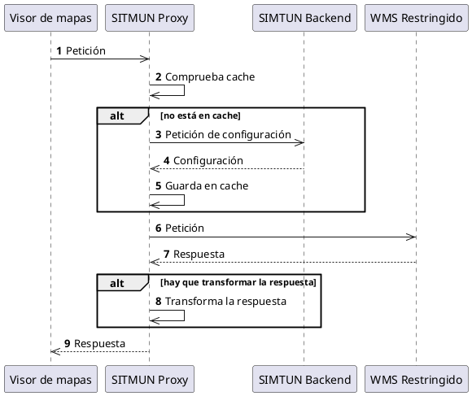

# Diseño

## Proxy

Un componente clave del sistema es un **[proxy inverso](https://es.wikipedia.org/wiki/Proxy_inverso)** para que se pueda
dar acceso a servicios web y a bases de datos restringidas. 
Para ello, el proxy debe conocer la configuración de los servicios remotos y bases de datos utilizando 
la **API de Configuración y Autorización de Proxy**.

### Comportamiento esperado

Debajo se muestra el comportamiento esperado del proxy.


El comportamiento esperado es el siguiente:

1. El **visor de mapas** hace una petición que es servida por el **proxy**.
2. El **proxy** comprueba si tiene en caché la configuración del servicio remoto para esta petición.
3. Si no está en la caché del **proxy**, este realiza una petición a la **API de Configuración u Autorización** en el **backend** para obtener la configuración.
4. La **API de Configuración u Autorización** proporciona la configuración de la petición al servicio remoto al **proxy**.
5. El **proxy** guarda en caché la configuración asociada a la petición.
6. El **proxy** compone una petición adecuada al servicio remoto y la envía.
7. El **servicio remoto** devuelve una respuesta.
8. Si es necesario, el **proxy** aplica una transformación a la respuesta.
9. El **proxy** devuelve la respuesta al **visor de mapas**.

### Ejemplo: OGC WMS

Las peticiones al **API de Proxy** tienen la siguiente forma 

```http
GET /proxy/{appId}/{terId}/{type}/{typeId}?{keys*}
Authorization: Bearer {token}
```

Lo que permite identificar:

- `appId`: identificador de la aplicación que realiza la petición.
- `terId`: identificador del territorio en el que se realiza la petición.
- `type`: tipo de servicio que se solicita.
- `typeId`: identificador del servicio que se solicita.
- `keys`: parámetros adicionales que se envían al servicio.
- `token`: token de autenticación.

Por ejemplo, la siguiente petición correspondería con la petición de acceso a un servicio de mapas remoto:

```http
GET /proxy/1/34/wms/1?SERVICE=WMS&REQUEST=GetMap
    &LAYERS=SITMUN
    &FORMAT=image/png
    &TRANSPARENT=true&VERSION=1.1.1&SRS=EPSG:25831
    &BBOX=405913.25142303,4593667.2516974,411183.74857697,4599953.7483026
    &WIDTH=498&HEIGHT=594
Authorization: Bearer SOME-TOKEN    
```

La petición que el **proxy** realizaría al endpoint `/api/config/proxy` de la **API de Configuración y Autorización de Proxy** seria:

```json
{
  "appId": 1,
  "terId": 34,
  "type": "wms",
  "typeId": 1,
  "method": "GET",
  "parameters": {
    "SERVICE": "WMS",
    "REQUEST": "GetMap",
    "LAYERS": "SITMUN",
    "FORMAT": "image/png",
    "TRANSPARENT": "true",
    "VERSION": "1.1.1",
    "SRS": "EPSG:25831",
    "BBOX": "405913.25142303,4593667.2516974,411183.74857697,4599953.7483026",
    "WIDTH": "498",
    "HEIGHT": "594"
  },
  "id_token": "SOME-TOKEN"
}
```

La respuesta podría ser como sigue:

```json
{
  "type": "wms",
  "exp": 1623340800,
  "vary": ["BBOX"],
  "payload": {
    "uri": "https://geoserveis.icgc.cat/icgc_bm5m/wms/service",
    "method": "GET",
    "parameters": {
        "SERVICE": "WMS",
        "REQUEST": "GetMap",
        "LAYERS": "01_NIVJERARQUIC_LN,02_TIPUSLINIA_LN",
        "FORMAT": "image/png",
        "TRANSPARENT": "true",
        "VERSION": "1.1.1",
        "SRS": "EPSG:25831",
        "WIDTH": "498",
        "HEIGHT": "594"
    }
  }
}
```

La petición a realizar por el proxy debe:

- Ser a la URI indicada en el campo `uri` de la respuesta.
- Con el método HTTP indicado en el campo `method` de la respuesta.
- Con los campos y valores indicados en el campo `parameters` de la respuesta.
- Con los campos y valores indicados en el campo `vary` de la petición del **visor de mapas**.

Es decir:

```http
GET /icgc_bm5m/wms/service?SERVICE=WMS&REQUEST=GetMap
    &LAYERS=01_NIVJERARQUIC_LN,02_TIPUSLINIA_LN
    &FORMAT=image/png
    &TRANSPARENT=true&VERSION=1.1.1&SRS=EPSG:25831
    &BBOX=405913.25142303,4593667.2516974,411183.74857697,4599953.7483026
    &WIDTH=498&HEIGHT=594
Host: geoserveis.icgc.cat
```

La respuesta de la **API de Configuración y Autorización de Proxy** respuesta debe almacenarse en una caché asociada
a una clave única basada en la petición realizada y que no contenga el campo variable `BBOX` hasta que expire
la autorización (el campo `exp` de la respuesta).
