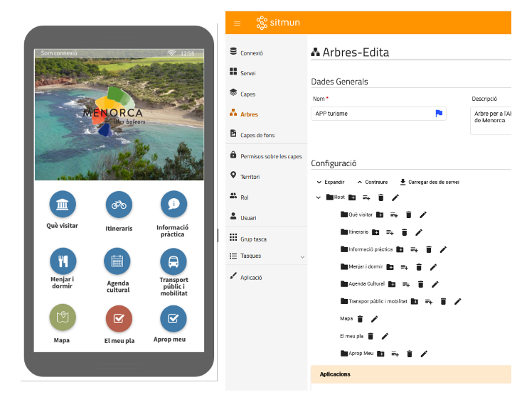

# Cliente APP SITMUN aplicada a los recursos turísticos

!!! info "Aspectos generales"

    **Estimación horas de desarrollo:** 2.500 horas

    **Entidad solicitante:** Consell Insular de Menorca

    **Prioridad:** MEDIA

    **Persona o entidad de referència o contacto:** Consell Insular de Menorca

## Objetivo

Esta funcionalidad busca dotar a la plataforma SITMUN de la capacidad de configurar aplicaciones móviles a través de
un primer caso de uso de una APP turística.

## Contexto y casos de uso

Hasta este momento desde el administrador SITMUN se pueden configurar clientes web, gestionando los contenidos,
las funcionalidades y los permisos de acceso a los mismos. El objetivo con esta nueva funcionalidad es ampliar el tipo
de clientes SITMUN y que, desde el administrador SITMUN se pueda configurar un nuevo tipo de clientes: aplicaciones
para dispositivos móviles.

La idea principal es aprovechar la potencia y versatilidad de SITMUN, como plataforma de administración de aplicaciones,
para poder gestionar los contenidos (y funcionalidades) de aplicaciones para dispositivos móviles.

El siguiente ejemplo ilustra la idea de funcionalidad que se requiere.

En la imagen de la izquierda se puede ver el menú principal de una APP, mientras en la imagen de la derecha se
representa cómo se podría configurar este menú en el administrador SITMUN.

## Requerimientos funcionales

Al objeto del presente documento, se entenderá por aplicación cliente como la aplicación final para dispositivos
móviles (tanto Android como iOS) que debe estar disponible en las plataformas correspondientes y que ofrecerá
información (turística) y funcionalidades asociadas al usuario.

Por administrador (de aplicaciones) SITMUN se entenderá la aplicación web de la plataforma SITMUN que permite la
configuración de aplicaciones por usuario final. Esta aplicación ya está desarrollada en una
[versión beta inicial](https://github.com/sitmun/sitmun-admin-app).

El administrador SITMUN ha de disponer de la capacidad de poder configurar los apartados, contenido y funcionalidades
de una APP de forma flexible.

En el ejemplo anterior (en el contexto) se ilustra la configuración del menú principal. El siguiente ejemplo ilustra
la configuración del contenido un apartado específico.

Por último, se ilustra cómo se podría definir el contenido de uno de los subapartados de la imagen anterior.
De forma que dicho contenido no se define en el administrador SITMUN sino que se define los parámetros de conexión al
servicio web o base de datos que contiene los datos que se van a representar.

A partir de la lógica que se define a través de estos ejemplos de aplicación, los requerimientos funcionales generales de la APP cliente SITMUN son:

- Presentar la secuencia o flujo de aplicación de acuerdo con aquello definido en administrador SITMUN.
  Cada punto o entrada del menú con sus atributos (imagen, título, descripción…) y anidada correctamente según la
  estructura definida.
- Presentar los datos obtenidos a través de una conexión a base de datos o servicio web definido en el administrador SITMUN.
- Disponer de un mapa que permita visualizar todos los contenidos georeferenciados del mismo árbol de contenidos de la aplicación.
- Marcar los lugares de interés favoritos.
- Proponer al resto de usuarios otros lugares de interés.

Para el administrador SITMUN los requerimientos funcionales son:

- Definir el menú y submenú de la aplicación a partir de la definición de nodos y subnodos de árbol del administrador SITMUN.
- Configurar los contenidos del cliente APP a partir de la configuración de conexiones a servicios de mapas, servicios web,
  API y/o conexiones a bases de datos.
- Configurar las funcionalidades de la APP a partir de la configuración de tareas SITMUN.

Se identifican los siguientes requerimientos funcionales a desarrollar para cada uno de los componentes de la arquitectura de SITMUN:

### Cliente Administrador

+----------------------------------------------------------+----------------------+---------------------+
| Funcionalidad                                            | Estado               | Issues relacionadas |
+==========================================================+======================+=====================+
| Permitir que un árbol pueda incorporar no solo capas sino| Nueva                |                     |
| también tareas SITMUN.                                   |                      |                     |
+----------------------------------------------------------+----------------------+---------------------+
| Ampliar los atributos para cada nodo del árbol de        | Nueva                |                     |
| aplicación                                               |                      |                     |
+----------------------------------------------------------+----------------------+---------------------+

### Cliente visualizador (API SITNA)

No se prevén modificaciones dea este componente durante el desarrollo de esta funcionalidad.

### API de autenticación

No se prevén modificaciones dea este componente durante el desarrollo de esta funcionalidad.

### API de administración

No se prevén modificaciones dea este componente durante el desarrollo de esta funcionalidad.

### API configuración y autorización

No se prevén modificaciones dea este componente durante el desarrollo de esta funcionalidad.

### API de proxy

No se prevén modificaciones dea este componente durante el desarrollo de esta funcionalidad.

### Esquema de base de datos

No se prevén modificaciones dea este componente durante el desarrollo de esta funcionalidad.
