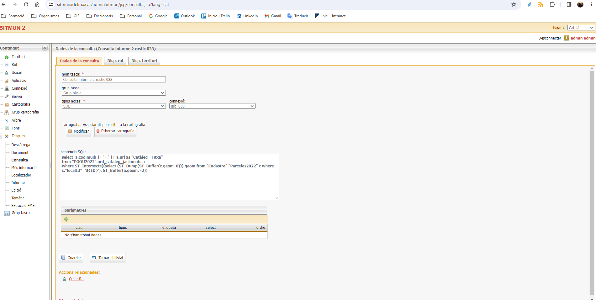
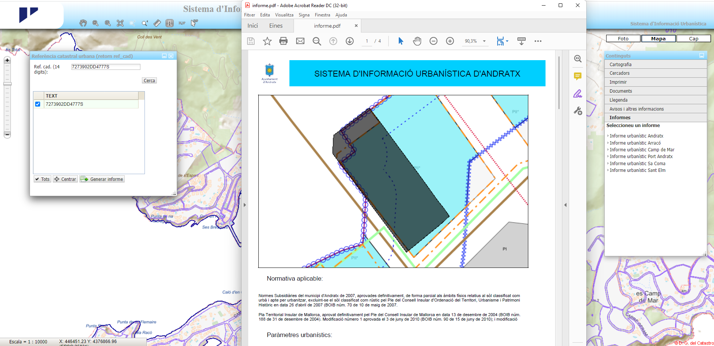
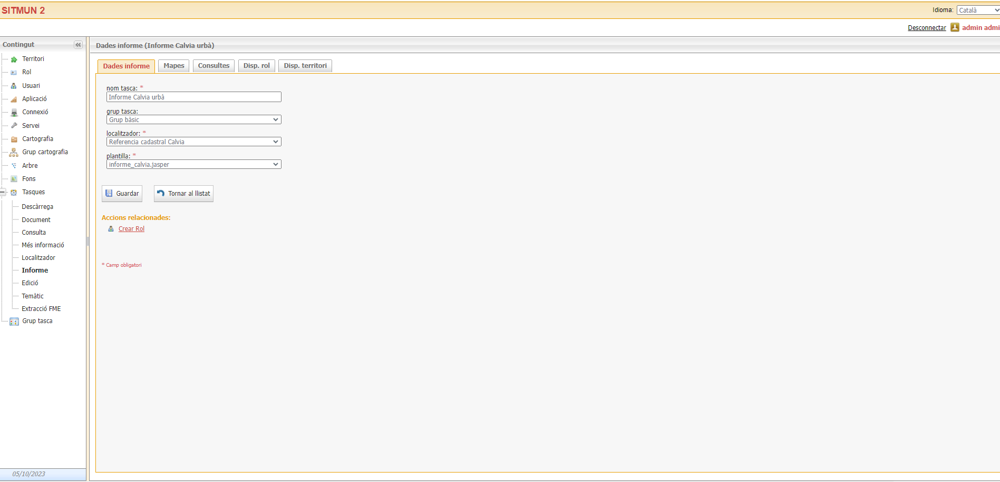

# Informe

!!! info "Aspectos generales"

    **Estimación horas de desarrollo:** ?? horas

    **Entidad solicitante:** Agueda Isern, Consell Insular de Mallorca

    **Prioridad:** BAJA

    **Persona o entidad de referéncia o contacto:** Agueda Isern, Consell Insular de Mallorca

## Objetivo

Esta funcionalidad busca dotar a SITMUN 3 de la capacidad de configurar, desde el administrador SITMUN 3,
el contenido de una ventana que devuelve el visor SITMUN 3 cuando el usuario busca una referencia catastral o
dirección del visor o como información complementaria del "Más info".

El contenido de la ventana debe poder integrar el mapa de una parcela, la respuesta de varias consultas definidas como
tareas al propio administrador y otros textos e imágenes que pueden ser fijos para cada territorio.

## Contexto y casos de uso

Como ejemplo se puede observar el funcionamiento de SITMUN 2 en el caso de los visores de urbanismo del
Consell de Mallorca, en el geoportal IDELMA.
Actualmente, los informes pueden generarse a partir de un localizador o dentro de información avanzada de una consulta.
En la ventana siguiente podemos observar el detalle de la ventana con distintas pestañas, cada una de ellas se
corresponde con el resultado de una tarea de tipo consulta configurada en el administrador SITMUN 2.

Actual ventana de ejemplo de configuración de una tarea tipo consulta en SITMUN 2.

El informe en el SITMUN 2 que funciona a partir de un localizador se genera a partir de una plantilla fija,
un mapa (a través de un grupo de capas) y una serie de consultas:

Actual ventana de ejemplo de configuración de una tarea tipo informe en el SITMUN 2.
Para generar el informe en el cliente se introduce una referencia catastral, se selecciona el objeto encontrado
y el cliente descarga un archivo en formato PDF:

Ejemplo de informe del SITMUN 2.

## Requerimientos funcionales

Se prevé la siguiente lógica funcional:

1. Configurar la apariencia de la ventana tipo layout que generará el informe: logos, títulos, textos explicativos
    y cualquier aspecto del estilo de la plantilla (color, letra, ubicación de los diferentes objetos de la plantilla).
    Cada uno de ellos son objetos que el administrador permite colocar y darle un tamaño determinado dentro de la plantilla.
2. Configurar el localizador. Para que se genere el informe, primero el usuario busca una referencia catastral o dirección.
3. Configurar el “Más info” en el caso de querer generar el informe como información de un objeto.
4. Configurar el mapa. En el SITMUN 3 el mapa se configura seleccionando las capas que deben aparecer y su orden,
    así como la escala del mapa.
5. Configurar consultas. En el administrador SITMUN 3 se definen distintos tipos consultas a bases de datos,
    consultas a servicios… que formaran parte de la ventana del informe.

Por ejemplo, en el caso del visor urbanístico anterior, se establecen varias consultas:

- Una primera tarea que consiste en consulta que devuelve toda la información relativa a la cualificación de la parcela:
  casco antiguo, residencial extensiva, residencial intensiva, etc.
- Una segunda consulta que devuelve la información relativa al Patrimonio arquitectónico
- Una tercera consulta que devuelve la referencia catastral y dirección de la parcela seleccionada
- Una imagen de la fachada del edificio o una imagen de una tabla de un texto

6. Una vez definidas estas tareas, que llamaremos tareas hijas, se configuraran en el administrador SITMUN la tarea
    padre informe. En la ventana de configuración de dicha tarea se podrá:
    - Configurar la plantilla del informe
    - Establecer el mapa, así como la escala, que aparecerá en el informe
    - Establecer las consultas que deben aparecer en el informe
    - Establecer las imágenes que aparecerán en el informe
    - Definir qué territorios y roles de usuario tienen asociada esta funcionalidad.
7. Cliente SITMUN - API SITNA deberá configurar correctamente la ventana de informe cuando se realice la búsqueda de la
   referencia catastral o la dirección o cuando se active el “Más info”.

Se identifican los siguientes requerimientos funcionales a desarrollar para cada uno de los componentes de la arquitectura de SITMUN:

### Cliente Administrador

+----------------------------------------------------------+----------------------+---------------------+
| Funcionalidad                                            | Estado               | Issues relacionadas |
+==========================================================+======================+=====================+
|                                                          |                      |                     |
+----------------------------------------------------------+----------------------+---------------------+

### Cliente visualizador (API SITNA)

+----------------------------------------------------------+----------------------+---------------------+
| Funcionalidad                                            | Estado               | Issues relacionadas |
+==========================================================+======================+=====================+
|                                                          |                      |                     |
+----------------------------------------------------------+----------------------+---------------------+

### API de autenticación {#roadmap-informe-api-de-autenticacion}

No se prevén modificaciones dea este componente durante el desarrollo de esta funcionalidad.

### API de administración {#roadmap-informe-api-de-administracion}

No se prevén modificaciones dea este componente durante el desarrollo de esta funcionalidad.

### API configuración y autorización {#roadmap-informe-api-de-configuracion-y-autorizacion}

No se prevén modificaciones dea este componente durante el desarrollo de esta funcionalidad.

### API de proxy {#roadmap-informe-api-de-proxy}

No se prevén modificaciones dea este componente durante el desarrollo de esta funcionalidad.

### Esquema de base de datos

No se prevén modificaciones dea este componente durante el desarrollo de esta funcionalidad.
